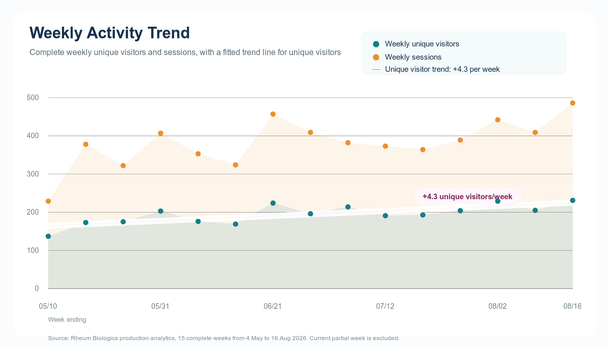
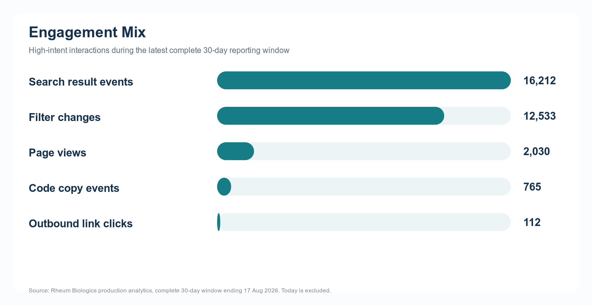
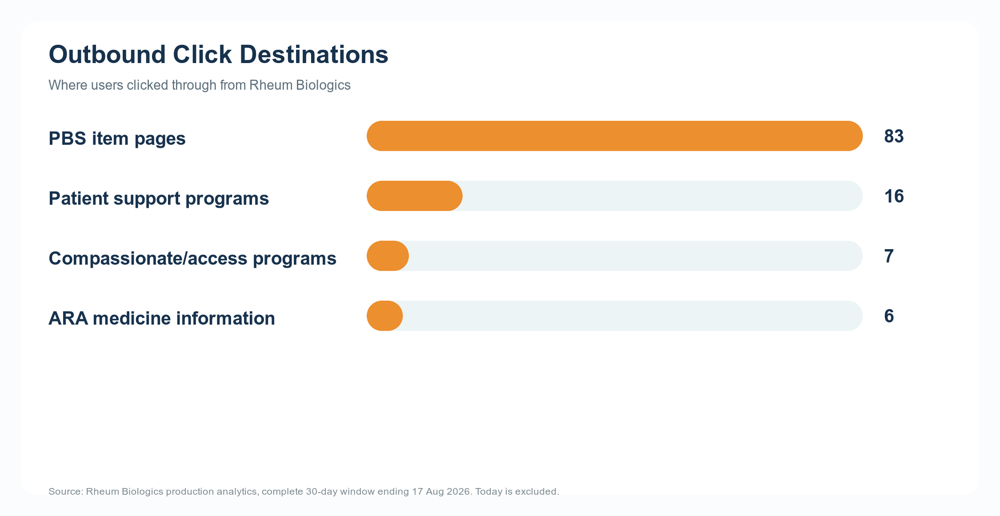

# Rheum Biologics Sponsorship Media Kit

Last updated: 18 August 2026

Website: https://www.rheumbiologics.com  
Contact: admin@rheumai.com

## Overview

Rheum Biologics is an independent Australian PBS biologics access lookup tool built for rheumatology clinicians and teams. It helps users quickly search PBS biologic and targeted synthetic DMARD listings by drug, brand, indication, formulation, treatment phase, hospital type, and PBS item code.

The site is designed around practical access questions: finding the right PBS item code, checking authority details, copying item and streamlined codes, and linking out to PBS, ARA medication information, patient support programs, and compassionate or managed access resources where available.

## Audience

Rheum Biologics reaches a focused, high-intent clinical audience. Users are not coming for general health information; they are using the tool during PBS access, prescribing, biologics support, and medication information workflows.

Current usage snapshot from production analytics, 30 complete days ending 17 August 2026:

| Metric | Last 30 days |
| --- | ---: |
| Bot-filtered unique anonymous visitors | 532 |
| Bot-filtered sessions | 1,804 |
| Bot-filtered page views | 2,030 |
| Raw anonymous visitor IDs | 543 |
| Search result events | 16,212 |
| Filter changes | 12,533 |
| PBS or streamlined code copy events | 765 |
| Outbound link clicks | 112 |

Recent 90-day usage:

| Metric | Last 90 days |
| --- | ---: |
| Bot-filtered unique anonymous visitors | 1,107 |
| Bot-filtered sessions | 5,001 |
| Bot-filtered page views | 5,659 |
| Raw anonymous visitor IDs | 1,136 |
| Search result events | 42,613 |
| Filter changes | 32,694 |
| PBS or streamlined code copy events | 1,380 |
| Outbound link clicks | 305 |

Visitor counts represent anonymous browser/device identifiers and are bot-filtered using user-agent patterns. They should not be interpreted as individually verified rheumatologists.

The current PBS dataset includes August 2026 PBS biologics schedule data with 2,061 rows.

{ width=92% }

The weekly activity trend covers 15 complete weeks from 4 May to 16 August 2026. The fitted trend line for weekly unique visitors is positive at approximately +4.3 unique visitors per week. The current partial week is excluded.

## Engagement Signals

Rheum Biologics captures anonymised interaction data that shows active use of the tool, not just passive page views.

In the last 30 days:

| Interaction | Count |
| --- | ---: |
| PBS item code copies | 749 |
| Streamlined code copies | 16 |
| PBS outbound link clicks | 83 |
| Patient support link clicks | 16 |
| Compassionate or managed access link clicks | 7 |
| ARA medication information clicks | 6 |

These interactions indicate use at the point of practical access and prescribing support. Copy events are especially useful because they suggest users are taking item codes or streamlined codes into another workflow.

{ width=92% }

{ width=92% }

## Sponsorship Benefits

Sponsorship offers visibility in a narrow, clinically relevant setting. The sponsor is associated with maintaining a practical access resource for Australian rheumatology teams.

Included benefits:

- Sponsor acknowledgement on the Rheum Biologics website.
- Company logo placement in a dedicated "Sponsored by" section.
- Link from sponsor logo or sponsor text to an approved sponsor URL.
- Monthly de-identified analytics report.
- Reporting on site reach, engagement, PBS item-code copy activity, and outbound link activity.
- Option to include sponsor-specific link-click reporting where sponsor links are present.
- Association with ongoing hosting, maintenance, data ingestion, and feature development.

## Sponsorship Packages

Prices are annual sponsorship fees in Australian dollars. GST treatment can be confirmed once the contracting entity is finalised.

| Package | Annual fee | Availability | Inclusions |
| --- | ---: | --- | --- |
| Non-exclusive sponsorship | $10,000 p.a. | Multiple sponsors possible | "Sponsored by" section with company logo, sponsor link, and monthly analytics report |
| Exclusive sponsorship | $30,000 p.a. | One sponsor only | Sole sponsor placement, no competing sponsor logos during the sponsorship period, sponsor link, and monthly analytics report |

## Monthly Analytics Report

Each sponsor receives a polished monthly report generated from the Rheum Biologics dashboard data.

The monthly report can include:

- Unique visitors, sessions, and page views.
- Search and filter engagement.
- Most-used drugs, brands, indications, and PBS item codes.
- PBS item-code and streamlined-code copy activity.
- Outbound click activity by destination type.
- Patient support and compassionate/access link engagement.
- Month-on-month usage trends.
- Sponsor-specific click reporting where applicable.

Reporting is aggregate and de-identified. Rheum Biologics does not provide sponsors with individual user identities, IP addresses, patient data, or identifiable clinical activity.

## Editorial Independence

Rheum Biologics is intended to remain an independent clinical access tool.

Sponsorship does not include:

- Influence over PBS data presentation.
- Preferential ranking of medicines.
- Changes to clinical or access information based on commercial preference.
- Sponsored clinical claims inside search results.
- Access to identifiable user or patient-level data.

Sponsor acknowledgement is separated from search results and data outputs. PBS, ARA, patient support, and access program links are presented as factual external resources where available.

## Sponsor Asset Requirements

Recommended sponsor assets:

- Company logo as SVG or transparent PNG.
- Approved sponsor destination URL.
- Short sponsor display name.
- Any medical/legal requirements for the sponsor acknowledgement.

Suggested acknowledgement format:

> Sponsored by [Company Name]

Sponsor material should avoid product claims unless separately approved and compliant with applicable Australian medicines advertising and healthcare professional communication requirements.

## Suggested Response To Sponsor

Thank you for your interest in supporting Rheum Biologics. I have attached a short media kit with current audience reach, engagement metrics, sponsorship benefits, and available annual packages.

At present, sponsorship is available as either a non-exclusive package at $10,000 per annum or an exclusive package at $30,000 per annum. Both include website sponsor acknowledgement and access to a polished monthly analytics report generated from de-identified dashboard data.

I would be happy to discuss which option best fits your objectives.
